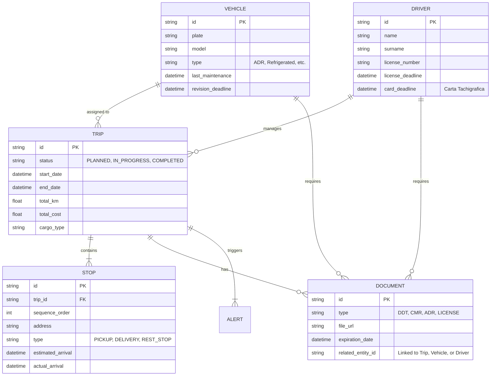

# Documento di Progetto: Web App Pianificazione Viaggi Logistica

## Introduzione
Questo documento definisce le specifiche funzionali e tecniche per lo sviluppo di una web application dedicata alla pianificazione e gestione dei viaggi per un'azienda di logistica italiana. L'obiettivo primario è l'ottimizzazione operativa garantendo al contempo il rispetto delle normative stringenti (Reg. CE 561/2006, ADR, Codice della Strada).

## Indice
1. [Stack Tecnologico](#stack-tecnologico)
2. [Modello Dati Globale](#modello-dati-globale)
3. [Modulo 1: Pianificazione Viaggi](#modulo-1-pianificazione-viaggi)
4. [Modulo 2: Ottimizzazione Rotte](#modulo-2-ottimizzazione-rotte)
5. [Modulo 3: Tipologia di Trasporto](#modulo-3-tipologia-di-trasporto)
6. [Modulo 4: Benessere dell'Autista](#modulo-4-benessere-dellautista)
7. [Modulo 5: Documentazione e Compliance](#modulo-5-documentazione-e-compliance)
8. [Modulo 6: Dashboard e Reportistica](#modulo-6-dashboard-e-reportistica)

---

## Stack Tecnologico
L'applicazione sarà sviluppata utilizzando le seguenti tecnologie moderne per garantire scalabilità, performance e facilità di manutenzione:

- **Frontend**: [Next.js (App Router)](https://nextjs.org/) con TypeScript per una gestione robusta del codice.
- **Styling & UI**: [Tailwind CSS](https://tailwindcss.com/) per il design responsive e [shadcn/ui](https://ui.shadcn.com/) per componenti UI accessibili e curati.
- **Database**: [Neon DB](https://neon.tech/) (PostgreSQL serverless) per un database relazionale performante e scalabile.
- **ORM**: [Prisma](https://www.prisma.io/) (o Drizzle) per l'interazione type-safe con il database.
- **Autenticazione**: [NextAuth.js](https://next-auth.js.org/) o [Clerk](https://clerk.com/) per la gestione sicura dell'accesso degli utenti.
- **Mappe/Routing**: API di terze parti come Google Maps, Mapbox o OpenRouteService per il calcolo avanzato delle rotte e geocodifica.

---

## Modello Dati Globale
Il database è progettato per gestire in modo relazionale i core asset aziendali: Autisti, Veicoli, Viaggi e Documenti.

### Diagramma ER (Mermaid)


---

## Modulo 1: Pianificazione Viaggi

### Descrizione Funzionale
Questo modulo permette ai gestori logistici (Dispatcher) di creare missioni di trasporto, assegnarle a binomi veicolo-autista e monitorarne lo stato.

#### User Stories
- **Come Dispatcher**, voglio creare un nuovo viaggio definendo tappe di carico e scarico per organizzare la logistica giornaliera.
- **Come Dispatcher**, voglio visualizzare un calendario dei viaggi per identificare rapidamente conflitti di programmazione o disponibilità.
- **Come Autista**, voglio visualizzare il dettaglio delle tappe del viaggio assegnatomi per sapere dove recarmi e cosa trasportare.

### Flussi Operativi
1. **Creazione**: Il Dispatcher inserisce i dati generali del viaggio (data, tipologia merce).
2. **Definizione Tappe**: Vengono aggiunte tappe intermedie (Ritiro, Consegna, Sosta).
3. **Assegnazione**: Il sistema suggerisce veicoli e autisti idonei (basandosi su tipologia trasporto e ore di guida residue).
4. **Pubblicazione**: Il viaggio passa in stato "Programmato" e l'autista riceve una notifica.

### Modello Dati (Prisma Schema - Snippet)
```prisma
model Trip {
  id          String   @id @default(cuid())
  status      TripStatus @default(PLANNED)
  cargoType   String
  vehicleId   String?
  driverId    String?
  stops       Stop[]
  createdAt   DateTime @default(now())
  updatedAt   DateTime @updatedAt
  vehicle     Vehicle? @relation(fields: [vehicleId], references: [id])
  driver      Driver?  @relation(fields: [driverId], references: [id])
}

enum TripStatus {
  PLANNED
  IN_PROGRESS
  COMPLETED
  CANCELLED
}
```

### API Endpoints Principali
- **POST `/api/trips`**: Crea un nuovo viaggio.
- **GET `/api/trips`**: Ritorna la lista dei viaggi.
- **PATCH `/api/trips/{id}/assign`**: Assegna autista e veicolo.

---

## Modulo 2: Ottimizzazione Rotte

### Descrizione Funzionale
Il sistema calcola la rotta ottimale considerando non solo distanza e tempo, ma anche costi operativi e vincoli logistici (punti di interesse, restrizioni stradali).

#### User Stories
- **Come Dispatcher**, voglio che il sistema ordini automaticamente le tappe per minimizzare i km a vuoto.
- **Come Autista**, voglio ricevere ricalcoli in tempo reale in caso di traffico intenso per evitare ritardi.

### Flussi Operativi
1. **Input**: Tappe inserite nel Modulo 1.
2. **Calcolo**: Richiesta all'API (es. OpenRouteService) con profilo "HGV" (Heavy Goods Vehicle).
3. **Ottimizzazione**: Algoritmo del commesso viaggiatore (TSP) per il riordinamento delle tappe.
4. **Output**: Visualizzazione su mappa e salvataggio dei costi stimati.

### Modello Dati (Estensione Stop)
```prisma
model Stop {
  id                String   @id @default(cuid())
  tripId            String
  sequenceOrder     Int
  address           String
  latitude          Float
  longitude         Float
  estimatedArrival  DateTime
  trip              Trip     @relation(fields: [tripId], references: [id])
}
```

### API Endpoints Principali
- **POST `/api/routing/optimize`**: Riceve una lista di tappe e restituisce l'ordine ottimale.
- **GET `/api/routing/costs`**: Calcola la stima di pedaggi e carburante per una rotta specifica.

---

## Modulo 3: Tipologia di Trasporto

### Descrizione Funzionale
Gestione delle specifiche necessità per diverse categorie di merce, con vincoli su veicoli e percorsi.

#### Tipologie Gestite
- **Merce Generica**: Nessun vincolo particolare.
- **ADR (Merci Pericolose)**: Richiede certificazione ADR dell'autista e del veicolo. Percorsi vincolati ad evitare centri abitati o tunnel specifici.
- **Refrigerato**: Necessità di monitoraggio temperatura e veicoli con cella frigo.
- **Eccezionale**: Richiede permessi speciali e spesso scorta tecnica.

### Flussi Operativi
1. **Configurazione Merce**: Selezione della tipologia in fase di creazione viaggio.
2. **Validazione Asset**: Il sistema blocca l'assegnazione se l'autista o il veicolo non hanno i requisiti (es. patentino ADR scaduto).
3. **Routing Vincolato**: Le API di routing vengono interrogate con parametri specifici per evitare strade non idonee.

### API Endpoints Principali
- **GET `/api/transport-types`**: Lista delle tipologie e dei relativi vincoli.
- **POST `/api/vehicles/validate-for-cargo`**: Verifica se un veicolo può trasportare una determinata merce.

---

## Modulo 4: Benessere dell'Autista

### Descrizione Funzionale
Monitoraggio rigoroso dei tempi di guida e riposo in conformità al **Regolamento CE 561/2006**.

#### Regole di Business (Normativa)
- **Guida Giornaliera**: Max 9 ore (estendibile a 10 due volte a settimana).
- **Interruzione**: Pausa obbligatoria di 45 min ogni 4.5 ore di guida.
- **Riposo Giornaliero**: Almeno 11 ore consecutive (riducibili a 9 ore in casi specifici).

### Scenari d'Uso
- **Alert Preventivo**: Il sistema invia una notifica all'autista 30 minuti prima della scadenza del limite di guida.
- **Suggerimento Sosta**: Integrazione con POI (Punti di Interesse) per suggerire aree di sosta attrezzate lungo la rotta ottimale.

### Modello Dati (Log Guida)
```prisma
model DriverLog {
  id              String   @id @default(cuid())
  driverId        String
  startTime       DateTime
  endTime         DateTime?
  type            LogType // "DRIVING", "REST", "WORK", "AVAILABILITY"
  tripId          String?
  driver          Driver   @relation(fields: [driverId], references: [id])
}
```

### API Endpoints Principali
- **GET `/api/wellness/status/{driverId}`**: Restituisce il tempo di guida residuo per la giornata e la settimana.
- **POST `/api/wellness/log`**: Registra un cambio di attività (es. inizio sosta).

---

## Modulo 5: Documentazione e Compliance

### Descrizione Funzionale
Questo modulo gestisce l'intero ciclo di vita dei documenti necessari per il viaggio e per la conformità aziendale (veicoli e autisti).

#### Checklist Documentale per Viaggio
- **DDT (Documento di Trasporto)**: Obbligatorio per trasporti nazionali.
- **CMR (Lettera di Vettura Internazionale)**: Obbligatorio per trasporti internazionali.
- **Certificati ADR**: Necessari per merci pericolose.
- **Documenti Doganali**: Necessari per trasporti extra-UE.

### Flussi Operativi
1. **Generazione**: Emissione automatica di DDT/CMR basata sui dati del viaggio.
2. **Archiviazione**: Gli autisti possono caricare foto dei documenti firmati tramite la web app.
3. **Alert Scadenze**: Notifiche automatiche per documenti in scadenza (patenti, revisioni veicoli, assicurazioni).

### Modello Dati (Documenti)
| Campo | Tipo | Descrizione |
| :--- | :--- | :--- |
| `id` | UUID | Identificativo unico |
| `type` | Enum | DDT, CMR, ADR, PATENTE, REVISIONE |
| `entityId` | UUID | ID del Viaggio, Veicolo o Autista correlato |
| `status` | Enum | VALID, EXPIRED, MISSING |
| `expiryDate` | DateTime | Data di scadenza del documento |

### API Endpoints Principali
- **GET `/api/documents/{tripId}`**: Lista documenti associati a un viaggio.
- **POST `/api/documents/upload`**: Upload file (integrazione con S3 o simile).
- **GET `/api/compliance/alerts`**: Lista di tutti i documenti mancanti o scaduti nel sistema.

---

## Modulo 6: Dashboard e Reportistica

### Descrizione Funzionale
Fornisce una vista d'insieme sulle performance operative e sulla conformità normativa.

#### KPI Operativi
- **Viaggi Completati**: Conteggio viaggi per periodo.
- **Km Percorsi**: Totali e medi per veicolo/autista.
- **Costi Operativi**: Somma di carburante e pedaggi stimati vs reali.
- **Infrazioni**: Report automatico su sforamento tempi di guida.

### Visualizzazioni
- **Dispatcher Dashboard**: Mappa in tempo reale con posizione dei veicoli e stato dei viaggi.
- **Report Mensile**: Esportazione PDF/Excel con il riepilogo per la contabilità.

### API Endpoints Principali
- **GET `/api/stats/summary`**: KPI globali per la dashboard principale.
- **GET `/api/reports/driver/{id}`**: Statistiche dettagliate per un singolo autista.
- **GET `/api/reports/export`**: Genera file per il download (Excel/CSV).

---
